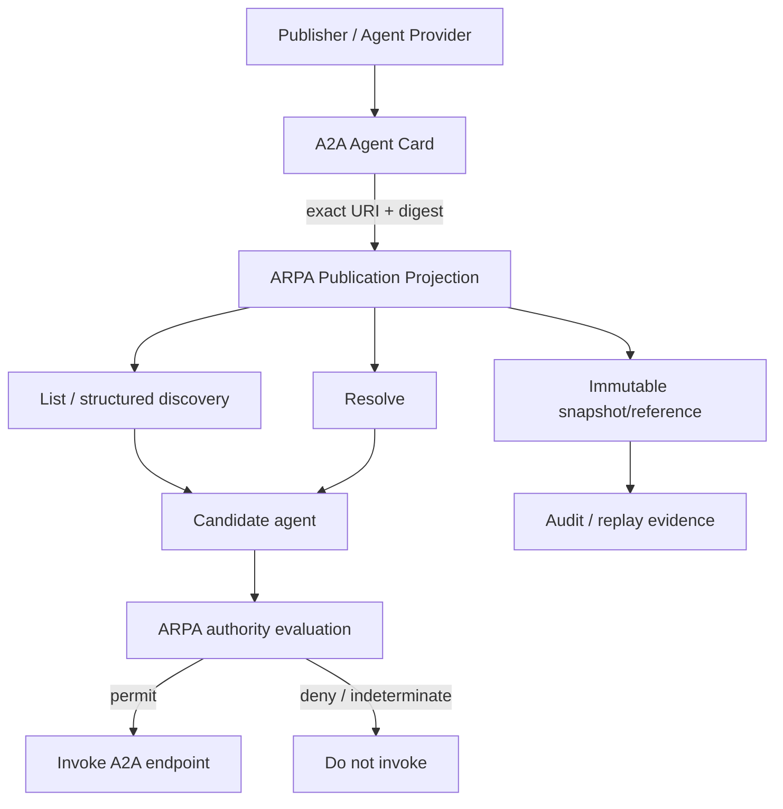

# A2A Registry Integration Guide

ARPA v0.9.3 aligns its A2A profile with the emerging registry model while preserving ARPA's authority-control boundary. The integration has three layers: portable **Agent Card**, registry **Publication Projection**, and caller-specific **Authorization Overlay**.

## Registration and publication

A publisher supplies or references an Agent Card. The registry records the exact source URI, content digest, observation time, disclosure class, lifecycle status and source-record provenance. The registry does not rewrite the card to encode local entitlements.

## Discovery

`GET /agents` is the ordinary discovery surface. Visibility is filtered by caller context. Unauthenticated requests receive only public projections; authenticated callers may receive additional projections permitted by local policy. Structured filters cover protocol version, skill, capability, namespace and disclosure class. Semantic/vector search is optional and outside the base profile.

## Resolve and snapshot

`GET /agents/{agent_id}` resolves the current ARPA view. Where an Agent Card representation participates in a consequential authority or execution decision, the registry retains an immutable digest-bound snapshot/reference so the decision can be reproduced.

## Compatibility

The repository compatibility classifier emits `compatible`, `breaking`, or `indeterminate`. Adding advertised functionality is normally compatible; removing skills, interfaces, security schemes, input/output modes, or disabling an existing capability is breaking. The classifier is evidence for change management, not proof of capability or authority.

## Governance invariants

- Discoverability is not authority.
- Publication is not delegation.
- Endpoint authentication is not permission to act.
- A card signature establishes integrity relative to its signer, not issuer competence or governance recognition.
- Authoritative ARPA suspension, revocation, delegation expiry and recognition withdrawal override published card content.

## Federation posture

ARPA v0.9.3 does not mandate centralized catalogs, a federation-of-catalogs architecture, a federation-of-peers architecture, xRegistry, SPIFFE/mTLS, DCAT/JSON-LD, DIDs, or a specific search engine. Those can be profiled or adapted without changing the publication/authority separation.

## Evidence produced

The release gate checks exact URI preservation, visibility filtering, immutable snapshots, compatibility classification and non-implication of authority. Results are written to `artifacts/interoperability/a2a-registry-report.json` and `artifacts/interoperability/a2a-registry-evidence-bundle.json`.
