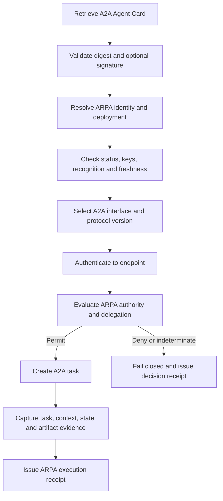

# A2A Agent Card Integration Guide

This guide implements the [ARPA A2A v1.0 Interoperability Profile](../spec/profiles/arpa-a2a-v1.0-interoperability-profile.md).

## Integration boundary

Use A2A Agent Cards to discover an agent's descriptions, interfaces, protocol versions, declared skills and endpoint authentication requirements. Use ARPA to determine canonical identity, lifecycle status, deployment validity, key status, authority, delegation, assurance, governance and revocation.

Do not display a single “verified agent” result. Present identity integrity, capability verification, authority, assurance and runtime status as separate signals.

## Recommended flow



## Card reference

Store each representation as an Agent Description Reference. Public and authenticated Extended Agent Cards require distinct records and digests. Contextual card content must not be indexed or disclosed outside its authorised audience.

## Interfaces

Create one Service Endpoint representation for each A2A interface. Preserve:

- endpoint URL;
- protocol binding;
- supported protocol version;
- deployment relationship;
- authentication requirements;
- status and freshness; and
- extension dependencies.

Do not collapse multiple interfaces into one generic endpoint.

## Skills

Map each A2A skill to a Capability Declaration with `claim_class: self_declared`. Preserve the external skill identifier and source-card digest. Examples and tags are descriptive inputs, not evidence of competence.

Link independent testing through Capability Verification records. Link permission to act through Authority Envelopes and decision receipts.

## Authentication and authority

A2A endpoint authentication MUST be evaluated independently from ARPA authority. A valid OAuth token, API key, mTLS credential or other endpoint credential does not prove that the agent or caller is authorised to perform the requested action for a principal.

## Signed cards

Record native card-signature verification as integrity evidence. Resolve the signer through ARPA Key Binding and status controls where available. Do not convert a valid signature into a competence, recognition or authority claim.

## Tasks, artifacts and receipts

For consequential work, bind the A2A `taskId`, `contextId`, selected interface, protocol version, terminal state and artifact digests into an ARPA Execution Receipt. Cryptographic artifact digests are the evidence anchors; artifact names are not stable identifiers.

## Revocation

ARPA suspension or revocation should block new tasks immediately at the enforcement point. Active A2A tasks should be cancelled where possible, but cancellation is not itself the authoritative revocation event. Record propagation time, cancellation outcome and any post-revocation outputs.

## Validation

Run:

```bash
python3 scripts/validate_a2a_interoperability.py
make release-check
```

The validator checks the mapping, schemas and positive and negative conformance vectors supplied with v0.9.2.
