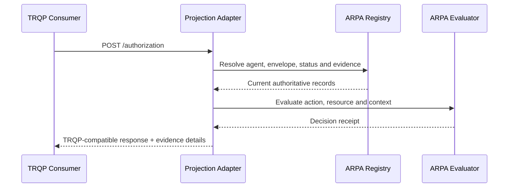
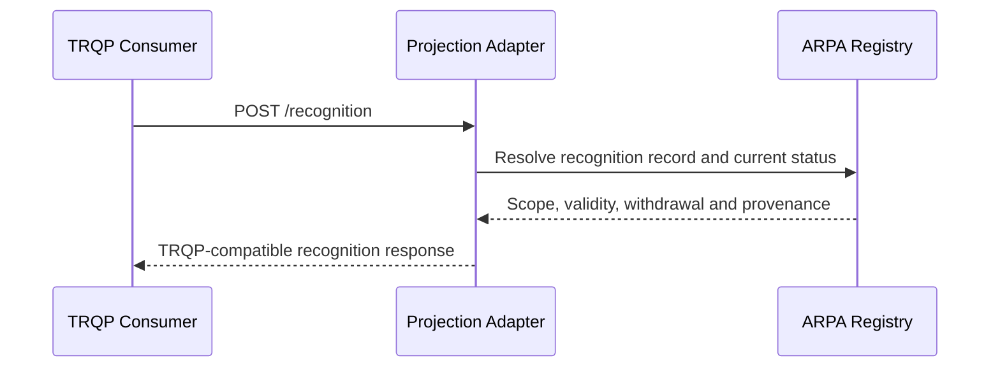

# ARPA–TRQP Interoperability Architecture

**Status:** Informative Candidate Specification companion for ARPA v0.9.0  
**Profile:** `arpa-trqp-query-projection-0.1`

## Purpose

ARPA and TRQP address different layers of a trust-registry system. ARPA governs agent identity, relationships, delegated authority, recognition, lifecycle state, evidence, events, enforcement convergence, federation, and redress. TRQP provides a minimal, read-only interface for asking authorization and recognition questions of an authoritative system of record.

The integration is therefore a **governed query projection**, not protocol adoption, merger, derivation, or transfer of normative authority.

```text
ARPA records + lifecycle + policy + evidence
                  |
                  v
       ARPA–TRQP projection adapter
                  |
                  v
      TRQP authorization / recognition
```

## Authority boundary

| Concern | ARPA responsibility | TRQP-facing responsibility |
|---|---|---|
| State creation and mutation | Defines registration, delegation, suspension, revocation and recognition lifecycle | None; query only |
| Authorization | Evaluates bounded authority, status, conditions and prohibitions | Returns a portable answer derived from current authoritative state |
| Recognition | Stores scoped, time-bound and withdrawable recognition | Returns whether one authority recognizes another for an action and resource |
| Evidence | Retains source records, receipts, event history and proofs | May expose references in response details |
| Discovery | Publishes registry capabilities and optional endpoint metadata | Uses a declared endpoint; no mandatory registry-of-registries is inferred |
| Conformance | ARPA profiles and evidence | Separately declared TRQP endpoint/consumer conformance |

ARPA conformance does not imply TRQP conformance. TRQP conformance does not imply ARPA conformance.

## Authorization sequence



An affirmative response is prohibited when authority is expired, revoked, suspended for the requested operation, outside delegated scope, stale where freshness is required, unsupported, or materially conflicting.

## Recognition sequence



Recognition is explicit, scoped, non-transitive by default, and does not transfer authority. Technical federation does not imply governance recognition.

## Lifecycle projection

| ARPA state | Query class | Required interpretation |
|---|---|---|
| `active` | Affirmative only when all other checks pass | Current evidence required |
| `suspended` | Negative | Temporary inactivity must be visible |
| `revoked` | Negative | Revocation evidence retained |
| `expired` | Negative | Validity window ended |
| `unknown` | Indeterminate | No reliable state available |
| `conflicting` | Indeterminate | Conflict must not be resolved optimistically |
| `unavailable` | Indeterminate | Source failure is not affirmative trust |

## Discovery declaration

An ARPA registry may publish an optional `trqp` capability block containing endpoint, version, query types, projection profile, governance profile and security profile. This is an ARPA interoperability declaration. It is not a mandatory TRQP discovery architecture.

## Information loss

TRQP core answers cannot carry the full ARPA delegation path, conditions, prohibitions, lifecycle history, enforcement acknowledgements or redress context. The mapping therefore records information loss and includes evidence references in response details where supported.

## Conformance and assurance

The v0.9.0 repository validates the mapping, safety rules, positive and negative vectors, two independent projection implementations, networked endpoint behavior, durable event handling and evidence reproducibility. These results demonstrate the supplied candidate implementation package only. They do not constitute certification, legal recognition, universal interoperability, or formal approval by the TRQP project.
