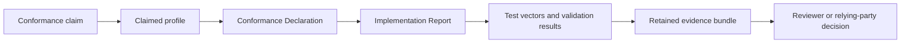

# Conformance Guide

ARPA conformance is multidimensional:

- protocol: schemas and API contracts;
- semantic: state transitions and processing outcomes;
- cryptographic: canonicalization, digests, proofs and key binding;
- operational: freshness, replay, recovery and availability evidence;
- governance: issuer competence, recognition, appeal and separation of duties;
- enforcement: revocation propagation and acknowledgement.

A schema-valid implementation is not automatically operationally or governance conformant. Publish a Conformance Declaration and an Implementation Report for every claimed profile.

## Conformance pathway

## Profiles

| Profile | Definition | Required for |
|---|---|---|
| [Profile A: Discovery](../conformance/profiles/profile-a.md) | ARPA-Core | Identity and discovery implementations |
| [Profile B: Accountable Operations](../conformance/profiles/profile-b.md) | Core, Relations, Assurance and Evidence | Operational registries without delegated authority |
| [Profile C: Delegated Authority](../conformance/profiles/profile-c.md) | Profile B plus Authority | Implementations making delegated-authority decisions |
| [Profile D: High Assurance](../conformance/profiles/profile-d.md) | Profile C plus Federation and stronger evidence | Cross-registry or high-assurance deployments |

## Required and supporting artefacts

| Artefact | Repository location | Purpose |
|---|---|---|
| Conformance Declaration schema | [`schemas/conformance-declaration.schema.json`](../schemas/conformance-declaration.schema.json) | Machine-validates the claimed profile and implementation identity |
| Valid declaration example | [`examples/valid/conformance-declaration.json`](../examples/valid/conformance-declaration.json) | Demonstrates the declaration structure |
| Implementation Report template | [Template](../conformance/reports/implementation-report-template.md) | Records multidimensional test and assurance results |
| Implementation Report schema | [`conformance/reports/implementation-report.schema.json`](../conformance/reports/implementation-report.schema.json) | Validates implementation-report structure |
| Reference implementation report | [`conformance/reports/reference-implementation-report.json`](../conformance/reports/reference-implementation-report.json) | Repository-controlled example evidence |
| Core vectors | [`TV-A-01-active-record.json`](../conformance/test-vectors/TV-A-01-active-record.json) and adjacent vectors | Tests core protocol outcomes |
| Extended governance vectors | [`EV-01-digest-stable.json`](../conformance/test-vectors/extended/EV-01-digest-stable.json) and adjacent vectors | Tests governance and enforcement outcomes |
| A2A v1.0 vectors | [`manifest.json`](../conformance/test-vectors/a2a-v1.0/manifest.json) | Enumerates tests for the optional A2A interoperability profile |
| Validation summary | [Validation Summary](../VALIDATION_SUMMARY.md) | Summarises current repository evidence |

## Claim discipline

A declaration MUST identify the exact profile, implementation version, evidence period and known limitations. Passing repository-controlled tests is implementation evidence, not independent certification, legal recognition or proof of production fitness.

For journey selection, see [Start Here](start-here.md). For module dependencies and non-implication rules, see [Protocol modules](protocol-modules.md).
