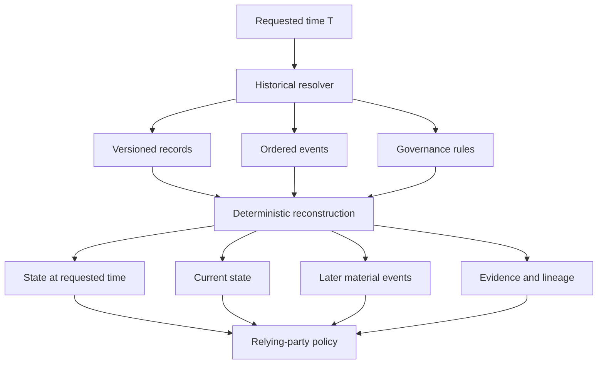

# Historical Authority Resolution

ARPA lifecycle state is time-dependent. A historical query therefore answers a different question from a current-status query: **what authoritative state applied at a requested time, based on the records, events, governance rules, and evidence available to the registry?**

This capability is designed for post-event verification, dispute resolution, audit, recognition withdrawal, compromise analysis, and other cases where the current state cannot safely stand in for the historical state.

## Core invariants

1. `state_at_requested_time` and `current_state` are separate results.
2. A registry MUST NOT substitute current state for historical state.
3. A later suspension, revocation, compromise, supersession, or recognition withdrawal MUST be disclosed when material to interpretation of the historical result.
4. `historically_active` does not imply `currently_active`.
5. `historically_active` does not imply that a relying party must accept the historical action. Relying-party policy remains outside the historical resolver.
6. Missing, conflicting, withheld, or integrity-failed evidence MUST produce a bounded non-affirmative reconstruction status rather than an invented historical state.

## Resolution model



The historical resolver establishes authoritative state and provenance. It does not make the relying party's ultimate legal, contractual, fiduciary, safety, or business acceptance decision.

## Response contract

A conforming historical-resolution response follows [`historical-resolution.schema.json`](../schemas/historical-resolution.schema.json) and exposes at least:

```yaml
subject: agentreg:example.org:agent-123
requested_time: 2026-07-15T10:00:00Z
evaluation_time: 2026-08-11T03:00:00Z
state_at_requested_time: {}
current_state: {}
reconstruction_status: authoritative_complete
selected_records: []
event_checkpoint: event:42
later_material_events: []
historical_effect: prospective
retention:
  evidence_available: true
  status: available
evidence:
  references: []
  integrity_status: verified
```

## Later material events

Historical resolution MUST disclose later events when they can change interpretation of the resolved state. Examples include revocation, suspension, reinstatement, supersession, key compromise, governance correction, recognition withdrawal, and evidence-integrity failure.

A later event carries a `historical_effect` of:

- `none`;
- `prospective`;
- `retroactive`;
- `governance_defined`; or
- `indeterminate`.

A registry MUST NOT infer retroactive effect merely because a current record is revoked or compromised. Retroactivity requires an applicable governance rule or authoritative event declaration.

## Retention and unavailable history

When a request predates retained evidence, the registry MUST disclose the retention boundary and return an `indeterminate` or partial reconstruction outcome. It MUST NOT silently answer using present state.

Where evidence exists but disclosure is restricted, the response SHOULD preserve a stable reference or commitment sufficient to distinguish `withheld` evidence from evidence that never existed or has been lost.

## Integrity and equivocation resistance

The registry MUST retain a tamper-evident lineage for records and material lifecycle events used in historical reconstruction. The mechanism is implementation- or profile-selectable, but the response MUST identify the mechanism and integrity status. A detected integrity failure is a release- and reliance-significant condition and MUST NOT yield an unqualified affirmative historical result.

## Relationship to TRQP

ARPA owns the lifecycle, event, evidence, revocation, enforcement, and historical reconstruction control plane. A TRQP projection may expose selected point-in-time authorization or recognition results, but that projection does not transfer lifecycle authority to TRQP and does not imply TRQP conformance. ARPA implementations SHOULD preserve the distinction between the requested historical time and the time at which the query was evaluated when projecting historical results.

This separation is intentionally aligned with the lifecycle and as-of verification concerns being discussed in ToIP TRQP issue #176 and UN/CEFACT GTR issue #75 without making either external project a normative dependency.
