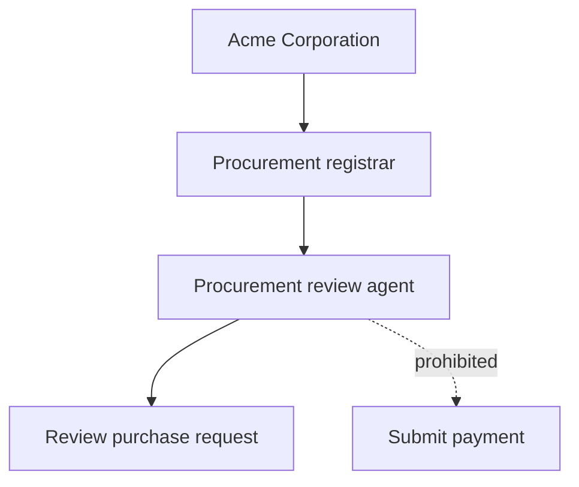

# Your first delegation

The sample delegation authorizes the procurement-review agent to evaluate bounded purchase requests but not submit transactions or transfer funds.

## Required pilot evidence

- an allow decision for an in-scope review request;
- a deny decision for a prohibited transaction request;
- receipts linked to the exact request digest;
- policy version and evaluator identity;
- event or audit retention sufficient for later review.
