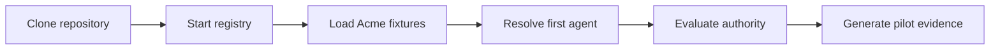

# ARPA Implementation Accelerator

The Implementation Accelerator is the shortest supported path from the ARPA theory of governed agent identity to a running, inspectable pilot registry.

It is **informative**. The [v0.9.0 Candidate Specification](../../spec/agent-registry-protocol-v0.9.0.md) remains normative. Accelerator assets demonstrate one implementation approach and produce evidence that can be tested, retained and reviewed.

## Choose a journey

| Intent | Start here | Outcome |
|---|---|---|
| Run ARPA now | [15-minute quickstart](01-15-minute-quickstart.md) | Registry, metadata and first agent |
| Understand the control plane | [First authority](03-first-authority.md) | Authority and accountable scope |
| Exercise delegation | [First delegation](05-first-delegation.md) | Bounded delegated authority decision |
| Prepare a pilot | [Pilot readiness](08-pilot-readiness.md) | Evidence bundle and readiness decision |
| Select a topology | [Deployment profiles](07-deployment-profiles.md) | Explicit operating assumptions |
| Harden an implementation | [Production hardening](09-production-hardening.md) | Operational control checklist |

## Executable path

## Success contract

A completed accelerator run produces machine-verifiable evidence for:

1. service health;
2. registry metadata;
3. canonical agent registration and resolution;
4. lifecycle status retrieval;
5. authority decision and decision receipt;
6. event generation;
7. pilot-readiness validation.
