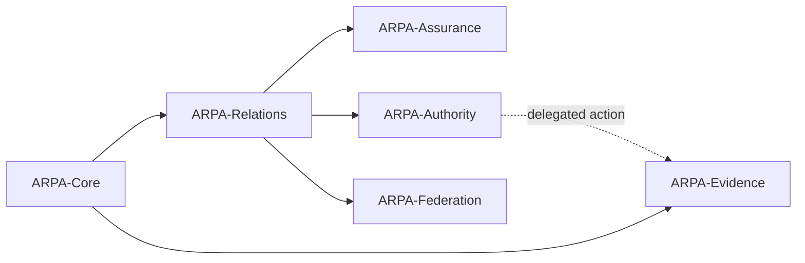

# Agent Registry Protocol documentation

This catalogue provides a stable GitHub Pages entry point for the complete normative specification, implementation guidance, governance material, conformance profiles, interoperability artefacts, and worked scenarios maintained in this repository.

> New to ARPA? Use [Start Here](start-here.md). This page is the exhaustive catalogue; the six journey pages provide the preferred reading order.

## Document status

| Status | Meaning |
|---|---|
| **Normative** | Defines core requirements against which conformance may be claimed. |
| **Profile normative** | Defines additional requirements applicable only when the optional profile is claimed. |
| **Informative** | Explains architecture, implementation, deployment, evidence or examples without changing normative requirements. |

ARPA v0.9.5 is the current implementation and cross-runtime interoperability release; v0.9.4 remains the historical-resolution baseline consumed by the TypeScript track. The v0.9.0 Candidate Specification remains the normative protocol baseline.

## Protocol module map

See [Protocol modules](protocol-modules.md) for the dependency table, profile mapping and non-implication rules.

## Choose an implementation path

- [Start Here](start-here.md) — compare architecture, local validation, pilot, release, conformance and A2A journeys.
- [Implementation Accelerator](implementation-accelerator/index.md) — run a pilot and produce readiness evidence.
- [Conformance Guide](conformance-guide.md) — assemble profile declarations, reports and retained evidence.

## Normative specification and profiles

- **Normative:** [Agent Registry Protocol Candidate Specification v0.9.0](../spec/agent-registry-protocol-v0.9.0.md)
- **Profile normative:** [ARPA Core Identity and Discovery Profile](../spec/profiles/arpa-core-identity-discovery-profile.md)
- **Profile normative:** [ARPA Identifier Profile](../spec/profiles/arpa-identifier-profile.md)
- **Profile normative:** [ARPA Proof and Digest Profile](../spec/profiles/arpa-proof-and-digest-profile.md)
- **Profile normative:** [ARPA Agent Card Interoperability Profile](../spec/profiles/arpa-agent-card-interoperability.md)
- **Profile normative:** [ARPA A2A v1.0 Interoperability Profile](../spec/profiles/arpa-a2a-v1.0-interoperability-profile.md)

## Getting started and implementation

- [Candidate specification guide](candidate-specification-guide.md)
- [Quickstart](quickstart.md)
- [Implementor guide](implementor-guide.md)
- [Implementation selection guide](implementation-selection-guide.md)
- [Deployment guide](deployment-guide.md)
- [Protocol modules](protocol-modules.md)
- [Reference implementation architecture](reference-implementation-architecture.md)
- [TypeScript implementation track](typescript-implementation.md)
- [Architecture-to-module mapping](architecture-to-module-mapping.md)
- [Design principles](design-principles.md)
- [Agent Card integration guide](agent-card-integration-guide.md)
- [Identifier resolution guide](identifier-resolution-guide.md)
- [Issuer competence and transfer](issuer-competence-and-transfer.md)

## Implementation Accelerator

- [Implementation Accelerator home](implementation-accelerator/index.md)
- [15-minute quickstart](implementation-accelerator/01-15-minute-quickstart.md)
- [Deployment profiles](implementation-accelerator/07-deployment-profiles.md)
- [Pilot readiness](implementation-accelerator/08-pilot-readiness.md)
- [Production hardening](implementation-accelerator/09-production-hardening.md)
- [API consumer toolkit](implementation-accelerator/10-api-toolkit.md)
- [Implementation Accelerator asset catalogue](../implementation-accelerator/README.md)

### Pilot governance and readiness assets

- [Pilot Starter Kit](../pilot-kit/README.md)
- [Governance readiness checklist](../pilot-kit/checklists/governance-readiness.md)
- [Security readiness checklist](../pilot-kit/checklists/security-readiness.md)
- [Operations readiness checklist](../pilot-kit/checklists/operations-readiness.md)
- [Exit and revocation checklist](../pilot-kit/checklists/exit-and-revocation.md)
- [Federated pilot topology](../pilot-kit/topologies/federated-pilot.md)

## Governance, security, privacy, and lifecycle

- [Governance model](../GOVERNANCE.md)
- [Governance operator guide](governance-operator-guide.md)
- [Security policy](../SECURITY.md)
- [Security deployment guide](security-deployment-guide.md)
- [Privacy implementation guide](privacy-implementation-guide.md)
- [Migration and versioning](migration-and-versioning.md)
- [Migration from v0.5.0 to v0.9.0](migration-v0.5.0-to-v0.9.0.md)
- [Release policy](release-policy.md)
- [Repository positioning](repository-positioning.md)
- [Known limitations](../KNOWN_LIMITATIONS.md)
- [Roadmap](../ROADMAP.md)

## Conformance and assurance

- [Conformance overview](../conformance/README.md)
- [Conformance guide](conformance-guide.md)
- [Profile A](../conformance/profiles/profile-a.md)
- [Profile B](../conformance/profiles/profile-b.md)
- [Profile C](../conformance/profiles/profile-c.md)
- [Profile D](../conformance/profiles/profile-d.md)
- [Implementation report template](../conformance/reports/implementation-report-template.md)
- [TRQP projection conformance](../conformance/trqp-projection/README.md)
- [Validation summary](../VALIDATION_SUMMARY.md)
- [Governance and security assurance](governance-security-assurance.md)
- [RAHP audit — 2026-08-16](assurance/rahp-audit-2026-08-16.md)

## Interoperability and reference material

- [Historical Authority Resolution](historical-authority-resolution.md)
- [ARPA–TRQP interoperability architecture](architecture/trqp-arpa-interoperability.md)
- [A2A v1.0 interoperability profile](../spec/profiles/arpa-a2a-v1.0-interoperability-profile.md)
- [A2A Agent Card integration guide](agent-card-integration-guide.md)
- [Interoperability guide](interoperability.md)
- [Interoperability tooling](../interop/README.md)
- [Reference implementation](../reference/README.md)
- [Independent implementation](../independent_impl/README.md)
- [TypeScript implementation track](typescript-implementation.md)
- [Schemas](../schemas/README.md)
- [Controlled registries](../registries/README.md)
- [Examples](../examples/README.md)

## Worked scenarios

- [Scenario catalogue](../examples/scenarios/README.md)
- [Bounded procurement](../examples/scenarios/bounded-procurement.md)
- [Compromised runtime](../examples/scenarios/compromised-runtime.md)
- [Delegated action](../examples/scenarios/delegated-action.md)
- [Emergency suspension](../examples/scenarios/emergency-suspension.md)
- [Enterprise workflow](../examples/scenarios/enterprise-workflow.md)
- [Federation conflict](../examples/scenarios/federation-conflict.md)
- [Fiduciary agent](../examples/scenarios/fiduciary-agent.md)
- [Healthcare access](../examples/scenarios/healthcare-access.md)
- [Informational agent](../examples/scenarios/informational-agent.md)
- [Operator change](../examples/scenarios/operator-change.md)
- [Public-service eligibility](../examples/scenarios/public-service-eligibility.md)
- [Stale projection](../examples/scenarios/stale-projection.md)
- [Historical authority resolution](../examples/scenarios/historical-authority-resolution.md)

## Project and release information

- [README](../README.md)
- [Contributing](../CONTRIBUTING.md)
- [Code of Conduct](../CODE_OF_CONDUCT.md)
- [AI usage](../AI_USAGE.md)
- [Changelog](../CHANGELOG.md)
- [v0.9.5 release notes](../RELEASE_NOTES_v0.9.5.md)
- [v0.9.4 release notes](../RELEASE_NOTES_v0.9.4.md)
- [v0.9.3 release notes](../RELEASE_NOTES_v0.9.3.md)
- [v0.9.2 release notes](../RELEASE_NOTES_v0.9.2.md)
- [Normative v0.9.0 release notes](../RELEASE_NOTES_v0.9.0.md)
- [v0.9.1 implementation accelerator release notes](../RELEASE_NOTES_v0.9.1.md)
- [v0.5.0 interoperability and evidence release notes](../RELEASE_NOTES_v0.5.0.md)
- [v0.4.0 protocol contracts and reference implementation release notes](../RELEASE_NOTES_v0.4.0.md)
- [Portfolio status](../PORTFOLIO_STATUS.md)

## Publication assurance

- [GitHub Pages publication assurance](PUBLICATION_ASSURANCE.md)

## v0.9.3 A2A registry convergence

See the [A2A Registry Integration Guide](a2a-registry-integration-guide.md) for publication, caller-visible discovery, resolve/snapshot, compatibility and authority-boundary semantics.
