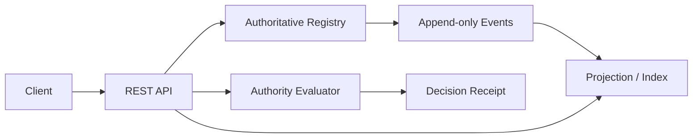

# Reference Implementation Architecture

The reference implementation contains a stateful registry, append-only event store, query resolver, materialized current-state projection and authority PDP. SQLite is used only for local reproducibility.

The service demonstrates protocol semantics. It does not provide production consensus, key custody, identity proofing, legal authorization or regulatory certification.
