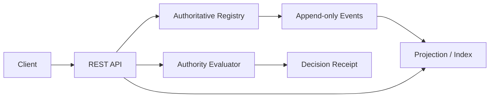
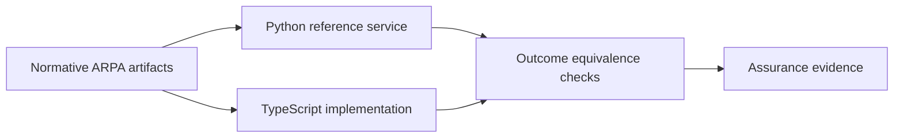

# Reference Implementation Architecture

The reference implementation contains a stateful registry, append-only event store, query resolver, materialized current-state projection and authority PDP. SQLite is used only for local reproducibility.

```mermaid
flowchart LR
  C[Client] --> API[REST API]
  API --> R[Authoritative Registry]
  R --> E[Append-only Events]
  E --> I[Projection / Index]
  API --> I
  API --> PDP[Authority Evaluator]
  PDP --> DR[Decision Receipt]
```

The service demonstrates protocol semantics. It does not provide production consensus, key custody, identity proofing, legal authorization or regulatory certification.

## Cross-runtime implementation assurance

The Python reference service remains the stateful reference architecture. The TypeScript track is intentionally separate and should not be described as a replacement reference service at this stage. Its role is to test whether a second runtime can derive equivalent behavior from the same normative ARPA artifacts without sharing evaluator implementation code.

```mermaid
flowchart LR
  N[Normative ARPA artifacts] --> PY[Python reference service]
  N --> TS[TypeScript implementation]
  PY --> CMP[Outcome equivalence checks]
  TS --> CMP
  CMP --> EV[Assurance evidence]
```
