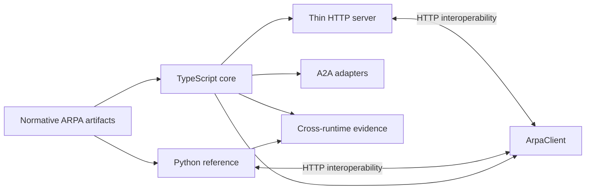

# TypeScript implementation

ARPA v0.9.5 adds a second runtime implementation under `typescript/`. Its purpose is implementation portability, developer adoption and specification assurance, not a line-by-line rewrite of the Python reference service.

## Independence rule

The TypeScript implementation consumes shared protocol artifacts — schemas, registries, profiles and conformance vectors — while implementing behavioural logic independently. It does not import or execute the Python authority evaluator.

A Python/TypeScript disagreement is therefore treated as a possible implementation defect, vector defect or specification ambiguity until resolved.

## v0.3.0 implementation surface

The TypeScript package currently provides:

- Profile A identifier-resolution semantics;
- deterministic Profiles B–D authority evaluation;
- effective-time and historical-resolution reliance semantics;
- fail-closed retention and evidence-integrity handling;
- schema-shaped authority decision receipts and request digests;
- event continuity/checkpoint primitives;
- a thin Node.js HTTP service;
- an `ArpaClient` capable of consuming both the Python and TypeScript registry surfaces;
- an in-memory record/event store for development and interoperability tests;
- A2A publication projection helpers that preserve exact Agent Card URI/digest provenance;
- conservative Agent Card compatibility classification;
- machine-readable deterministic, historical, A2A and network interoperability evidence.

## Developer use

```bash
cd typescript
npm install
npm run release-check
```

Run the development HTTP service:

```bash
npm run network-server
```

A local consumer can import the package surface:

```ts
import { ArpaClient } from "arpa-typescript-implementation";

const arpa = new ArpaClient("http://127.0.0.1:8000");
const registry = await arpa.registry();
const agent = await arpa.resolveAgent("agentreg:example.org:agent-123");
```

The package remains repository-private in v0.9.5; the API shape is usable locally but is not yet an npm stability commitment.

## Evidence

```bash
make typescript-check
make cross-runtime
make network-interop
```

produces:

```text
artifacts/typescript/conformance-report.json
artifacts/typescript/historical-resolution-report.json
artifacts/typescript/a2a-adapter-report.json
artifacts/typescript/implementation-report.json
artifacts/typescript/cross-runtime-report.json
artifacts/typescript/network-interoperability-report.json
```

The network harness proves bounded loopback HTTP interoperability in both directions, including use of the TypeScript client against the Python registry. Both implementations remain repository-controlled, so this is not external organisational independence.

## Architecture



## Governance invariant

Discovery, registration, Agent Card publication, endpoint authentication and successful resolution do **not** imply authority. The TypeScript APIs and A2A projection helpers preserve this non-implication explicitly.

## Deferred production concerns

v0.9.5 does not claim production persistence, proof verification, key custody, issuer-competence resolution, distributed federation, package API stability or external certification. Those remain deployment or post-Candidate work rather than hidden assumptions in the development server.
