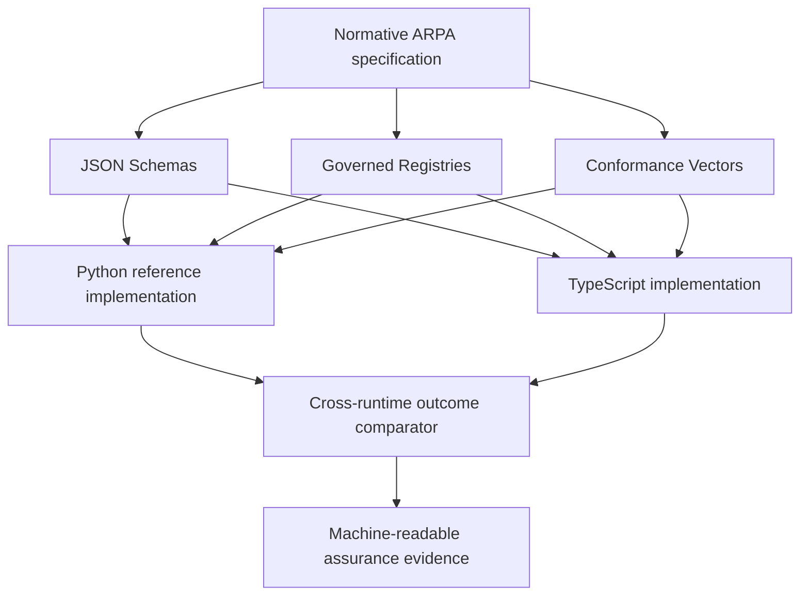

# TypeScript Implementation Track

ARPA v0.9.4 introduces the baseline used by a second runtime implementation track under `typescript/`. The purpose of the track is implementation portability and specification assurance, not a rewrite of the Python reference service.

## Assurance objective

The TypeScript implementation is expected to reach the same externally observable outcomes as the normative ARPA requirements while remaining behaviorally independent of the Python implementation. Both runtimes may share schemas, registries and conformance vectors because those are protocol artifacts. They must not share evaluator implementation code.

A disagreement between the runtimes is therefore treated as one of three things until resolved:

1. an implementation defect;
2. a conformance-vector defect; or
3. a specification ambiguity requiring normative clarification.

This makes implementation divergence a pre-v1.0 assurance signal rather than merely a software integration failure.

## Current v0.1.0 scope

The first milestone implements the deterministic surface required to exercise the existing shared test vectors:

- Profile A identifier-resolution outcomes;
- Profiles B-D deterministic authority evaluation;
- registration, operational and security status gating;
- status freshness;
- authority effective-time and expiry checks;
- action, resource and jurisdiction scope checks;
- mandatory prohibitions;
- quantitative limits;
- conditional approval outcomes;
- direct loading of governed schemas and registries;
- machine-readable implementation and conformance reports.

The implementation deliberately does **not** claim production proof verification, issuer-competence resolution, key custody, persistence, federation or organisational independence.

## Evidence

Running:

```bash
make typescript-check
make cross-runtime
```

produces:

```text
artifacts/typescript/conformance-report.json
artifacts/typescript/implementation-report.json
artifacts/typescript/cross-runtime-report.json
```

The cross-runtime report compares Python and TypeScript outcomes for the same test vectors. A passing comparison proves outcome equivalence over that bounded surface only. It does not by itself satisfy the v1.0 external independent-implementation requirement.

## Implementation boundary



The Python implementation and TypeScript implementation do not import behavioural code from one another.

## Planned progression

The TypeScript track should expand in bounded increments:

1. current deterministic conformance surface;
2. canonical and historical resolution APIs;
3. decision receipts and event handling;
4. a thin HTTP implementation over protocol services;
5. a TypeScript client package;
6. Python-to-TypeScript and TypeScript-to-Python network interoperability;
7. A2A publication and compatibility adapters;
8. external implementation participation before v1.0 promotion.

Every expansion should add machine-verifiable conformance evidence before adding convenience APIs.
