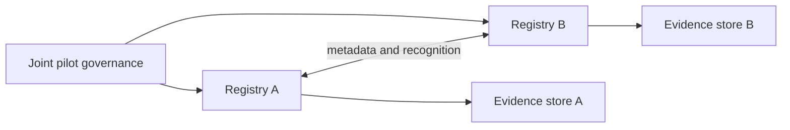

# Federated pilot topology

Operate two registries under separate accountable authorities. Exchange only registry metadata, scoped recognition, canonical resolution results and replay-safe lifecycle events. Do not replicate private operational records unless the pilot governance agreement explicitly authorizes it.

